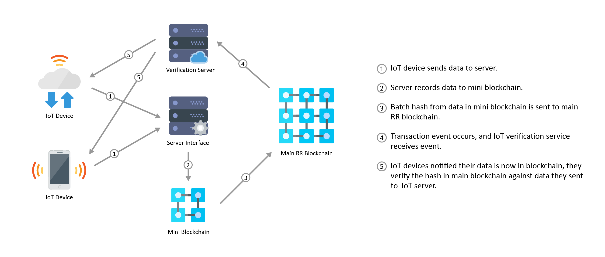

## IoT Server

  

### Device ( table name )
    Id              (int, auto-increment, primary key)
    Location        (varchar 255)
    Description     (text)
    Deleted         (date/time)
    Created         (date/time)
    Updated         (data/time)
    
### Device Reading ( table name )
    Id              (int, auto-increment, primary key)
    Device id       (int)
    Reading         (double)
    Hash            (varchar 255, default null)
    Date            (date/time)
    
>Notes: We need to create a separate nodejs resfulAPI server. The server need to include basic functionality to create, read (get/list), update, and delete devices. The server also need to include functionality for create and read (get/list) device reading table.

>*** create device reading need to keep track of how many records has been added without hash, once 25 readings has been added all, none hash readings, need to be hashed, the table field hash will then need to be updated and the hash, initial date, end date and device id need to be sent to the blockchain.

>*** read device reading will be done by batches of 25. The data of he batch will be read and hash, same way as when it was created, the hash value will be compared to the hash value of the blockchain for the device on the same period of time, if both hash values matches then the reading values on the database is considered valid.

### Blockchain

#### New asset
    Device reading
        Device id
        Hash  (field name)
        Initial date
        End date

#### New transaction
    Add device reading
    
#### New participant
    IoT server
    
#### ACL
    IoT server can only write to blockchain
    Everybody else can read from IoT server